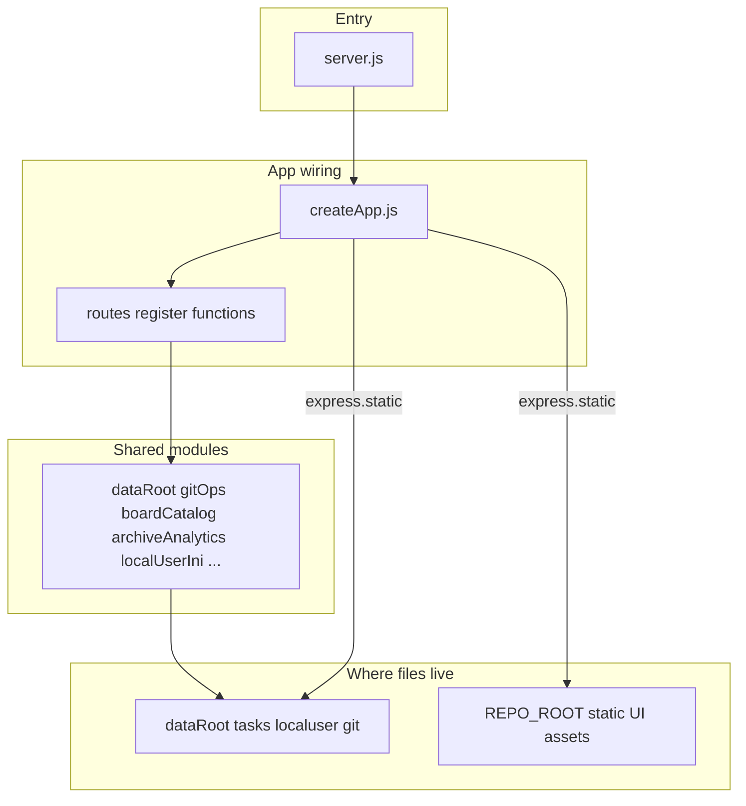
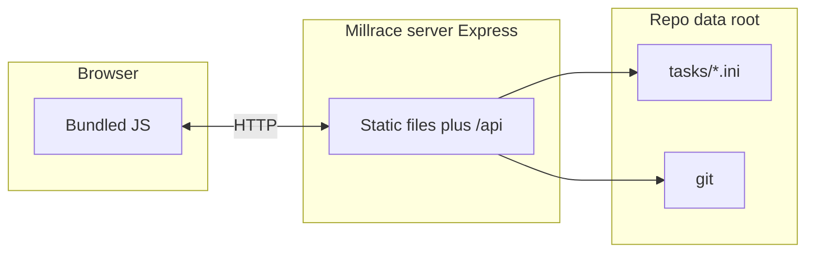
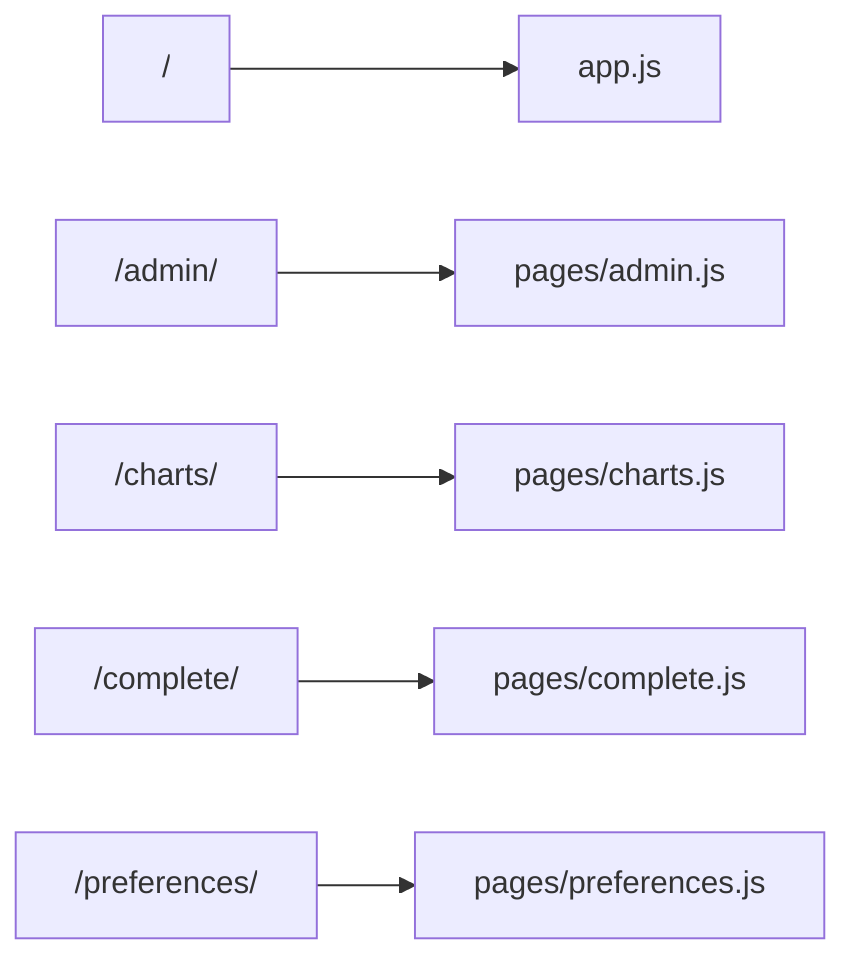
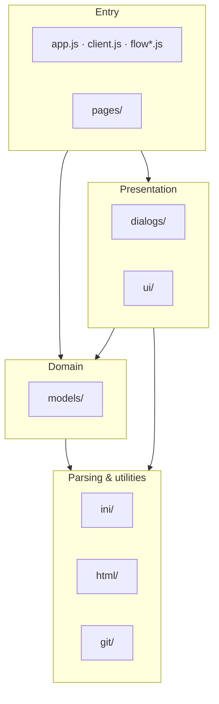

# Millrace

A millrace channels water to and from a water wheel. It has a narrow fast current with plenty of power. You control the flow of water to the wheel using the head race, and the water flows away from the wheel along the tail race.

The ability to control the flow of water along the millrace is crucial. The goal is an optimal flow that efficiently turns the water wheel. When it comes to mills, that's the backshot wheel (the water enters at the top of the wheel, in the opposite direction to the flow of the tail race), but for knowledge work it's Kanban with strategic <abbr title="work in process">WIP</abbr> limits.

Millrace is an lightweight git-friendly work management tool designed for optimal flow.

Because it doesn't try to be a project plan, resource schedule, or Gantt chart, Millrace is the backshot wheel of the *project management tools* category. And it's ideal for software teams as it lives in a Git repository.

Millrace is a **git-friendly** work item manager with a **Kanban-first** workflow. You create a git repository for you work, add the Millrace package from npm, and run the app to visuallly manage work, while git does all the hard work tracking changes in high-fidelity.

This isn't a watefall. It's engineering.

[Read the documentation](docs/index.md).

# Automatic screenshots

This project uses Playwright to automate screenshots. They can be refreshed using these stps:

1. Installing packages `pnpm install`
1. Installing screenshot dependencies `screenshots:install`
1. Running the app `pnpm start`
1. Running Playwright `pnpm screenshots`

# App design

We use the [Web UI Boilerplate Storybook](https://basher.github.io/Web-UI-Boilerplate/?path=/docs/web-ui-storybook-introduction--docs) by [Basher](https://basher.biz) for guidance on accessible modern UI.

## `server.js`

The API for the application: Express serves the static UI and `/api/*`, reads and writes `tasks/*.ini`, and runs git operations for sync and history. It imports the same `assets/js` ini, models, and git helpers as the browser bundles so parsing stays consistent.

### How the server code is organized

The **`millrace` npm binary** points at the repo-root **`server.js`**. That file stays small on purpose: it re-exports `app`, `setMillraceDataRootForTesting`, and `millraceIntegrationStartup` for integration tests, starts listening only when Node’s main module is `server.js`, and delegates the rest to **`server/`**.

- **`server/createApp.js`** — Builds the Express app: JSON body parser, registers all HTTP handlers, then mounts static file serving (your millrace data directory first, then the packaged UI from the repo root).
- **`server/routes/*.js`** — Each file exports a `register…Routes(app)` function for one area (flow, boards, columns and charts, cards, git sync, local user).
- **Everything else under `server/`** — Shared helpers: data root and CLI parsing, INI read/write for `tasks/localuser.ini`, git subprocess helpers, board catalog and card paths, archive/cold-storage and analytics helpers, and so on.

Dependencies generally flow in one direction: route modules call shared helpers; helpers do not import the Express app. That keeps circular imports predictable.

At runtime the picture is still “browser talks HTTP to Express, which reads and writes your repo”:

## `assets/js`

Bundled browser modules. Route-specific entry scripts live under **`pages/`**; shared libraries sit in the folders below (alongside top-level modules such as `app.js`, `client.js`, and `flow*.js`).

Each route’s `index.html` loads one entry module:

Conceptually, shared code stacks from route and app entry points down through UI and domain layers to parsing and small utilities:

- **`dialogs/`**: Modal flows for creating or editing boards and task cards (DOM, validation, and API calls).
- **`git/`**: Helpers around Git merge-conflict markers (detecting hunks, choosing a side), not a full Git client.
- **`html/`**: Low-level helpers: escape text for HTML, derive URL-safe slugs, parse markup strings into DOM nodes.
- **`ini/`**: INI parsing plus board/card helpers (sections, columns, swimlanes).
- **`models/`**: Structured board and task-card models derived from parsed INI text.
- **`pages/`**: Page entry bundles wired from each route’s `index.html` (admin, charts, completed work, preferences).
- **`ui/`**: Shared presentation pieces: header brand mark and styled modal alerts, confirms, and email prompts (replacing `alert` / `confirm`).

## features

Gherkin-syntax tests with cucumber.js steps.