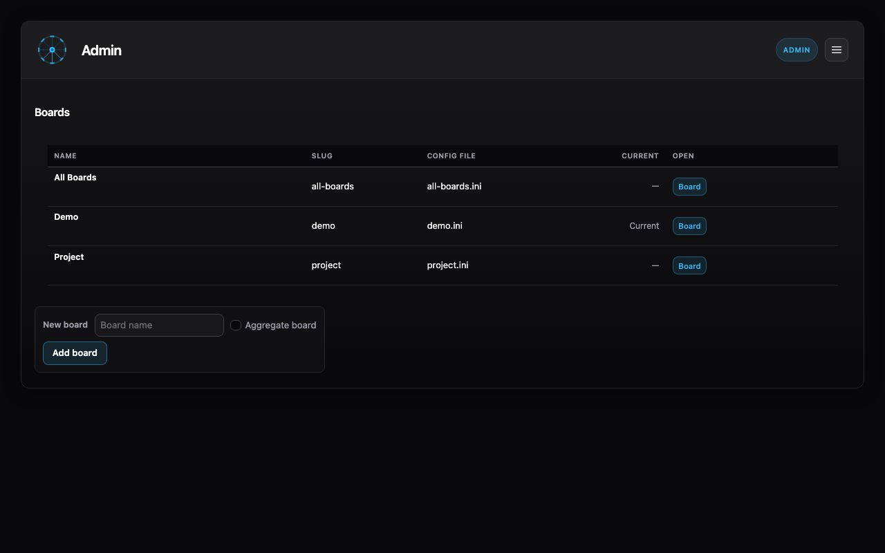
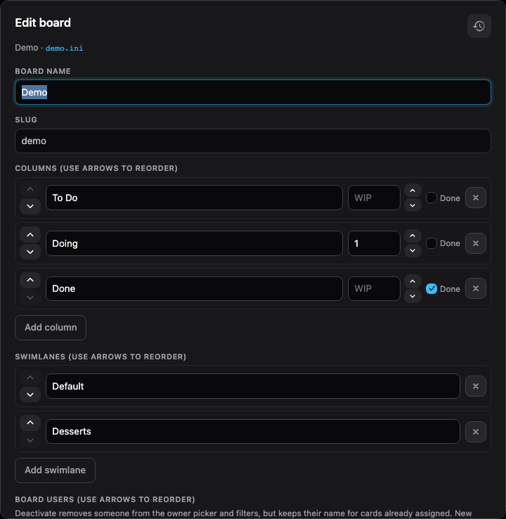

# Admin

The **Admin** view lists your boards and let's you manage them. You can add new boards, or edit existing boards from this view.

- **Edit** boards by using the edit icon (shown on hover)
- **Add** boards by entering a name and selecting **Add board**

The **Current** board indicates your local selected project.

## Customizing boards

When you **Edit** a board you can change it's name and customize the columns and swimlanes.

> [!WARNING]
> When you delete a column or swimlane, cards will be moved to the first column / first swimlane on your board. This prevents them going missing.

[← Millrace documentation](../)
