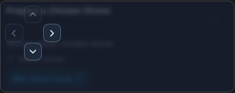
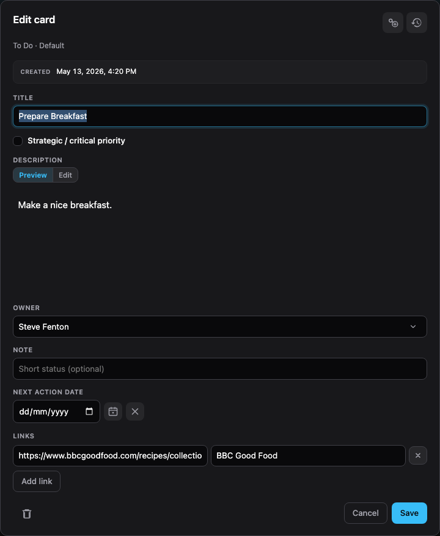

# Board

The **Board** view is the main Kanban workspace. Each board is divided in to columns and swimlanes, with <abbr title="Work In Process">WIP</abbr> limits shown and highlighted when they are exceeded.


Task cards are arranged on the board and you can drag and drop them to a new location. You can also click a card to open a navigation control that lets you movee the card.



## Collapse a swimlane

Each swimlane label has a small toggle button. Click it to cycle through three display modes:

1. **Fully open**: The swimlane grows to fit its cards (default).
2. **Scrolling**: The swimlane is capped to roughly half the viewport and scrolls vertically when there are more cards.
3. **Fully collapsed**: A thin row that hides the cards and shows a count badge for each column.

Selections are stored per board in `tasks/localuser.ini` under `[swimlanes.<board-slug>]`, keyed by swimlane name (for example `Bugs / UX = scroll`). They survive page reloads and stay personal to your machine (the file is git-ignored).

## Edit task cards

When you hover over a card, you can select the **Edit** icon to open the card editor. From here you can update your task information, add links, and use the header actions.

Card descriptions support limited **Markdown** (see [supported markdown](../markdown.md)).



You'll notice several icons on the card editor.

Along the top:

- **Duplicate**: Creates a copy of the card in the same column and swimlane. The copy includes a **Source card** link back to the original, and the editor opens on the new card so you can adjust the title or other fields right away.
- **History**: Shows changes made to the card.
- **Copy link**: Copies a shareable URL for this card.

Along the bottom:

- **Delete**: Deletes the card (after double-checking with you).

### Share a link to a card

Use **Copy link** in the card editor to copy a URL like:

```text
/index.html?board=demo&card=FLOW-mp1eqyhn-1j2hsw
```

- **`board`** is the board slug (the folder name under `tasks/`).
- **`card`** is the card ID — the task INI filename without the `.ini` extension.

When someone opens that link, Millrace loads the board and opens the card in the editor. The query string is removed from the address bar after the card opens.

On an **aggregate board**, copied links use the **source** board where the card file lives, not the aggregate board slug.

### Useful card features

- **Strategic**: Tick this box for crucial tasks, they get a target icon and extra highlighting.
- **Notes**: A short text field for useful contextual information, which is shown on the card.
- **Next action date**: Add a next action date to bring cards to your attention.

## Version control sync

The **Sync** button will pulse when you have local changes.

If your board is set to auto-sync, changes to task cards will be automatically committed and pushed after 5 seconds of inactivity.

If you have chosen to manually sync, press the **Sync** button to share your changes.

> [!TIP]
> If you have any merge conflicts, you'll be taken to a resolution view that will help you resolve them. If you are using auto-sync, this will rarely happen. Work in small batches. Sync often.

[← Millrace documentation](../index.md)

## Aggregate boards

An **aggregate board** combines open tasks from several normal boards into one view. Use it when you want a single place to see work spread across teams or streams, without copying cards.

On an aggregate board:

- **Columns** are always the five standard types (Options, To do, In progress, Waiting, Done). A card appears in the column whose type matches its column on the **source** board. For example, a card in a source board's "Doing" column which has the column type *In progress* shows under *In progress* on the aggregate board.
- **Swimlanes** are one row per source board (labelled with each board's name), so you can see which board a card belongs to.
- **Adding cards** is not available on an aggregate board; create or edit cards on the source board instead.
- **Moving cards** (drag-and-drop or the navigation control) updates the card on its source board. You can move cards between columns and reorder within a swimlane; you cannot move a card to a different source board's swimlane.

The badge in the header reads **Aggregate** instead of **Kanban**. **Completed** and **Charts** work the same way for aggregate boards, with data merged from all selected sources.

Set up an aggregate board from [Admin](../admin/index.md) (tick **Aggregate board** when adding, then **Edit** to choose source boards).
