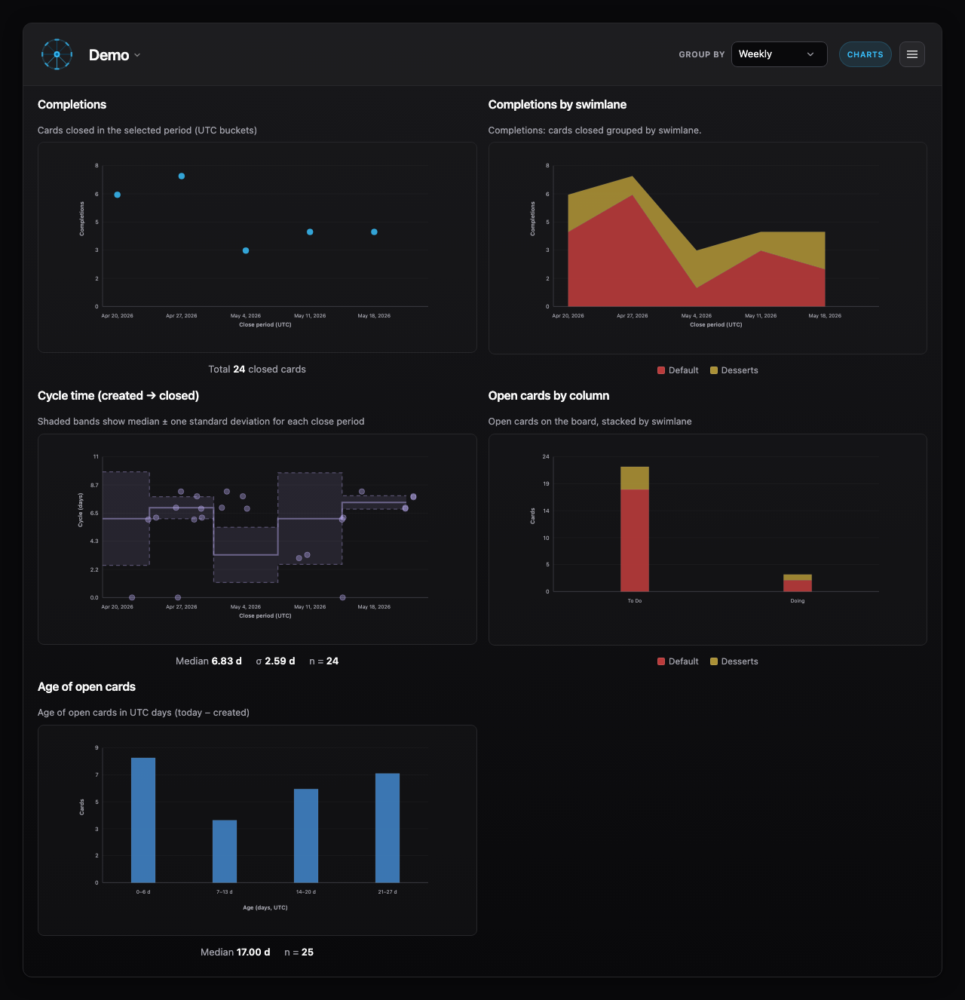
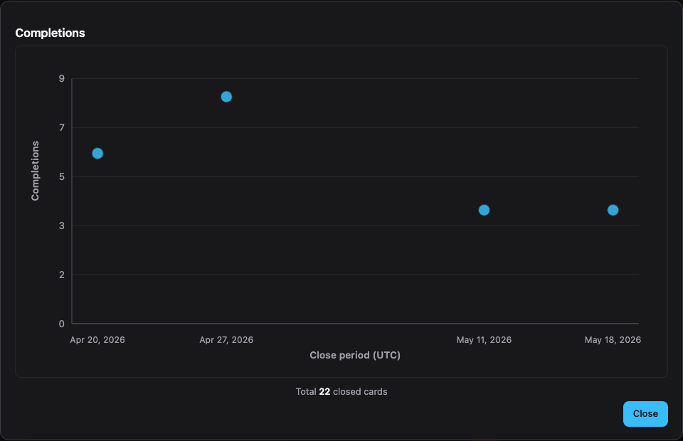
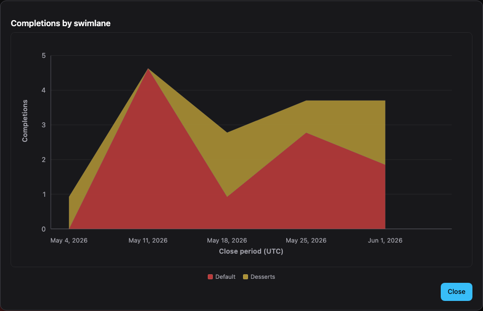
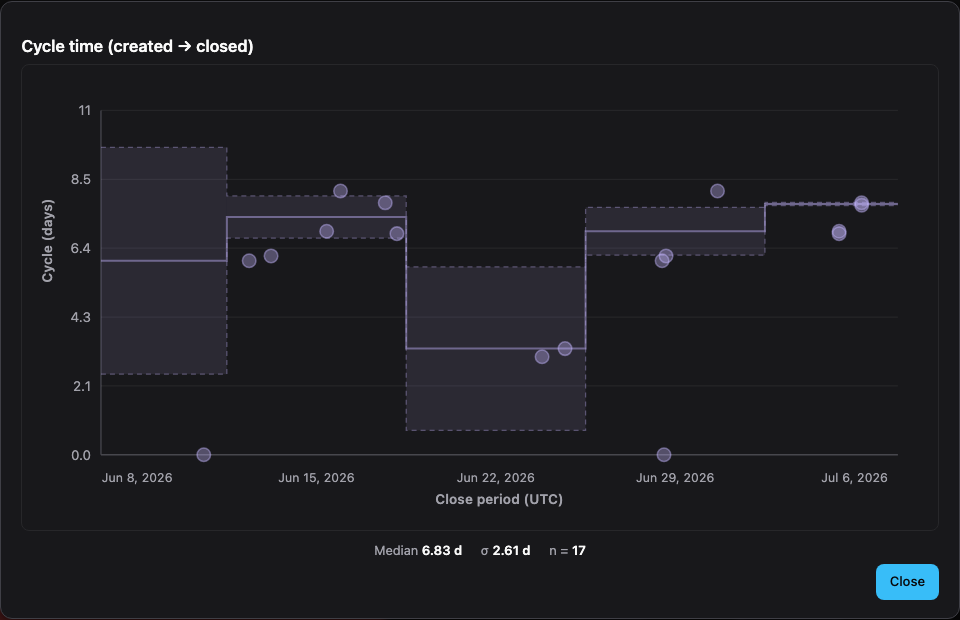
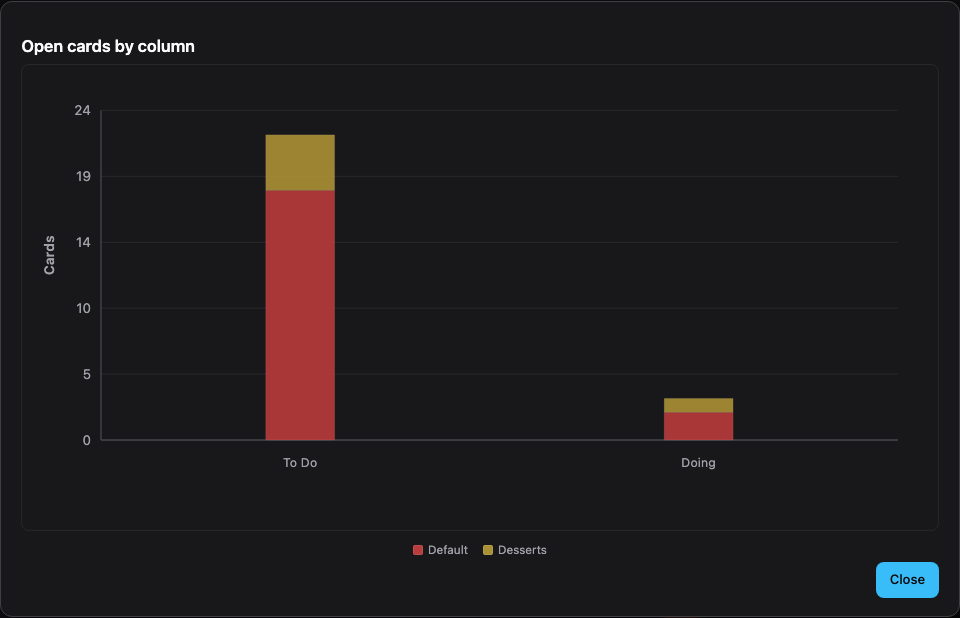
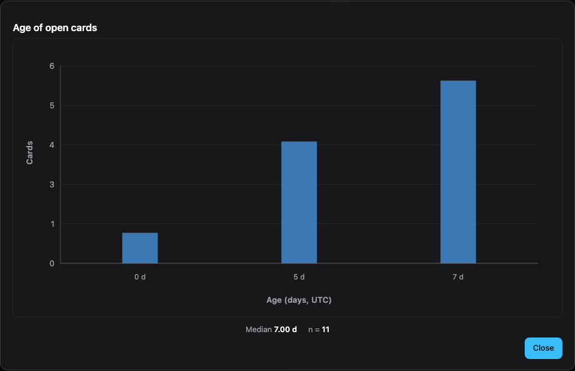

# Charts

The **Charts** view includes a number of *informational* charts you can use to inform your continuous improvement process. The dashboard is designed to avoid accidentally creating *motivational* measures, which trigger unintended issues (like Goodhart's Law).

>[!NOTE]
> Charts cannot be de-aggregated (i.e., you cannot show numbers for an individual) and we won't accept feature requests that compromise the informational value of the charts.

You can use the **Expand** icon to view a larger version of each chart.

## Granularity

You can set chart **granularity** (for example weekly vs monthly) from this view. That preference is stored with your local profile (see [Preferences](../preferences/index.md) and `tasks/localuser.ini` in the main docs).

## Completions

For the selected granularity, this chart shows the total cards completed.

## Completions by swimlane

For the selected granularity, this chart shows the total cards completed, grouped by swimlane.

## Cycle time

For the selected granularity, this chart shows the time it took a card to be completed. Each dot is placed on the card’s close date; median and one standard deviation are shown **per close period** (weekly or monthly), with an overall summary in the footer.

## Open cards by column

A snapshot of open cards on the board: count per column, stacked by swimlane.

## Age of open cards

Distribution of how long open cards have been on the board, in UTC days (today − created date).

[← Millrace documentation](../index.md)
