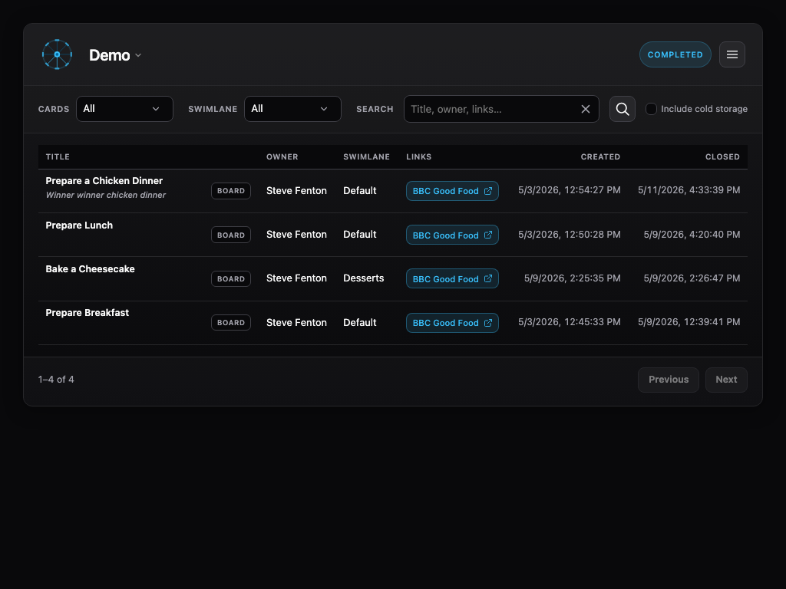

# Completed

The **Completed** view shows cards that are finished. These cards come from the board, from the archive, and if you choose **Search all**, from cold storage, abandoned cards, and in-flight cards too.

You can filter the card list by owner and swimlane, or perform a text search.

You can use the **Completed** view to see all tasks, while the [Board](../board/index.md) view limits the number of closed cards shown.

For aggregate trends across completions, use [Charts](../charts/index.md).

[← Millrace documentation](../index.md)
