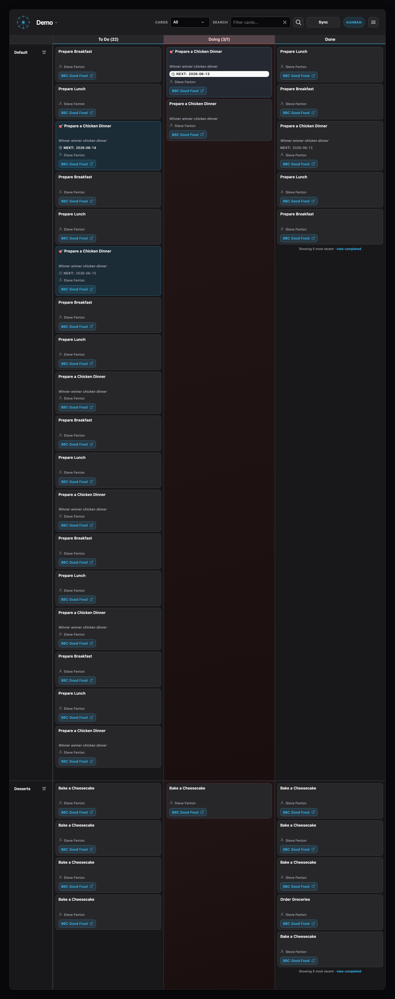

# Millrace

Millrace is a local web app you can use to manage work on customisable Kanban boards. It's built for developers and uses **git as the source of truth** for everything.

You can work in the UI, but all updates are captured in Git commits against human-readable INI files.

## Repository

Source and issue tracking: [github.com/Steve-Fenton/millrace](https://github.com/Steve-Fenton/millrace).

## Getting started

- [Quick start guide](quick-start/index.md)

## Using Millrace

You can find documentation for each of the views here:

- **[Board](board/index.md)**: Primary Kanban view
- **[Completed](completed/index.md)**: Browse closed items or search
- **[Charts](charts/index.md)**: Informational charts and cycle-time analytics
- **[Preferences](preferences/index.md)**: Local profile (Mine, default owner, sync mode)
- **[Users](users/index.md)**: Millrace users (email, display name, admin)
- **[Boards](admin/index.md)**: Create and customise boards

## Under the hood

This information may be useful to know. You don't normally hand-crank the INI files.

- **`tasks/localuser.ini`** stores machine-local preferences (default owner, charts granularity, sync hints); keep it gitignored.
- **`tasks/.millrace.ini`** (section **`[millrace]`**, key **`boards`**) lists active boards so you can switch between multiple boards in one repo.
- **Millrace users** (`[users.N]` in `tasks/.millrace.ini`) define email, display name, active flag, and optional `admin` flag for the whole repo.
- **Board definitions** (`*.ini` under **`tasks/`**) describe columns, optional swimlanes, board access, and WIP limits
- **Task cards** are stored in **INI files** under **`tasks/{board-slug}/`**
- **Column snapshots** for cumulative-flow charts live in **`tasks/{board-slug}/snapshots.json`** (daily open-card counts; Millrace captures and commits these automatically)
- **Abandoned cards** are moved to **`tasks/{board-slug}/abandoned/{year}/`** when you abandon a card from the editor

To keep current work items clean, an archiving process moves older tasks into archive and cold storage. Configure ages in **`tasks/.millrace.ini`** under **`[millrace]`** (omit a key to use the default):

- **`archive_closed_after_days`** — days after **`closed`** before a card in **`tasks/{slug}/`** moves to **`tasks/{slug}/archive/`** (default **14**; **0** disables).
- **`cold_storage_archive_after_months`** — months after **`closed`** before a file in **`archive/`** moves to **`tasks/{slug}/cold-storage/{year}/`** (default **12**; **0** disables).

The app automatically integrates with Git through the UI.

- **Sync** runs **`git pull`** then **`git push`** at the repo root that owns **`tasks/`** (requires **`.git`** and credentials on the server).
- Optional **`FLOW_GIT_AUTO_COMMIT`**: after changes under **`tasks/`**, stage and **commit** with a debounced delay (**`FLOW_GIT_COMMIT_DELAY_MS`**).
- **Git history** in the UI for a **board definition** file and for an individual **card** INI.
