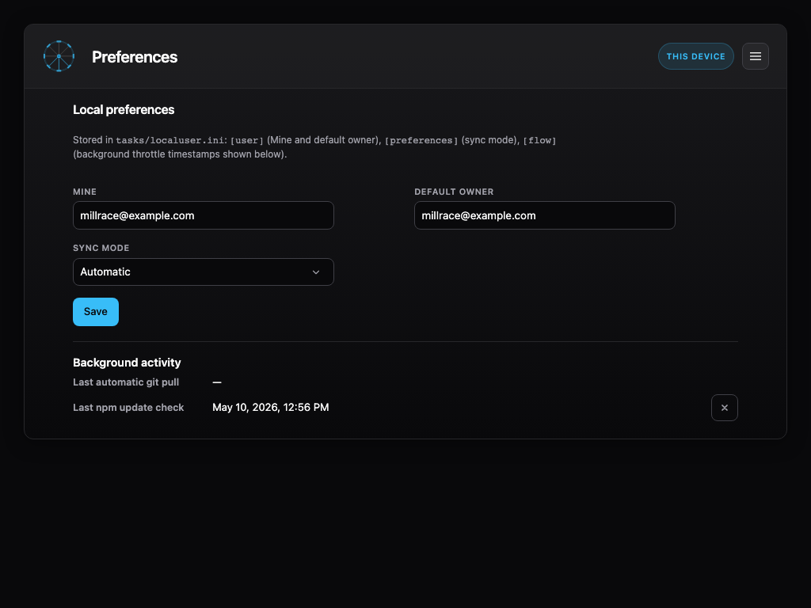

# Preferences

The **Preferences** view edits settings stored in **`tasks/localuser.ini`** (machine-local; keep that file gitignored). Changes apply across views after you save.

## Settings

- **Mine**: Email address used for the **Mine** owner filter on the board and elsewhere. Set this so “mine” means your cards.
- **Default owner**: Email prefilled when you **create** new cards.
- **Sync mode**: **Automatic** or **Manual** control over how sync behaves with your workflow (pair with the **Sync** control on the board).

Saving preferences triggers a refresh so lists and filters stay consistent.

> [!TIP]
> Usually the **MINE** and **DEFAULT OWNER** will both be set to your email address. However, if you create tasks on someone else's behalf, you can reduce friction by entering their email address in the **DEFAULT OWNER** field.

## Last check times

The last timestamp of `git pull` operations and npm update checks is shown in the preferences tab.

Clearing these fields will speed up the next operation. For example, an update check will be triggered shortly after clearing the "Last npm update check" field, rather than the usual behavior of waiting a day between checks.

When you clear these dates, the change is automatically applied, so there's no need to **Save** any changes.

[← Millrace documentation](../index.md)
