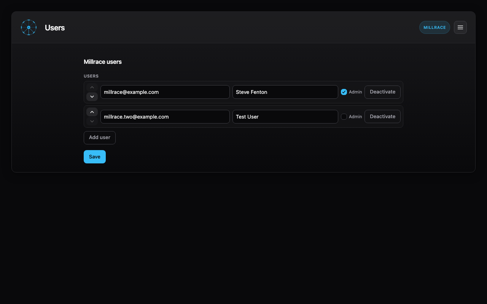

# Users

The **Users** view manages Millrace users stored in **`tasks/.millrace.ini`** as **`[users.N]`** sections. These users are shared across all boards in the repository.



- **Add** users with an email and display name
- **Admin** — users with the Admin checkbox are treated as Millrace admins (for example, archive automation and npm update prompts when their **Mine** preference matches)
- **Deactivate** users to hide them from owner pickers while keeping cards assigned to them
- **Save** writes changes to **`tasks/.millrace.ini`**

Board access is configured separately for each board from the [Boards](../admin/index.md) editor.

## Under the hood

Each user is a section like:

```ini
[users.1]
email = millrace@example.com
name = Steve Fenton
admin = true
```

Inactive users are stored with **`active = false`**. Legacy **`[millrace] admin_email`** is still honoured until users are saved from this view (it is then removed in favour of per-user **`admin`** flags).

[← Millrace documentation](../index.md)
